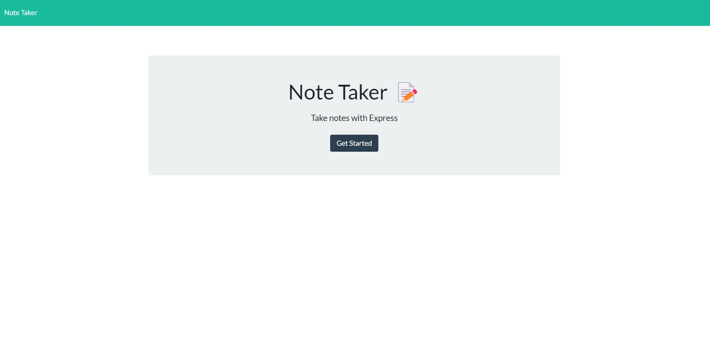
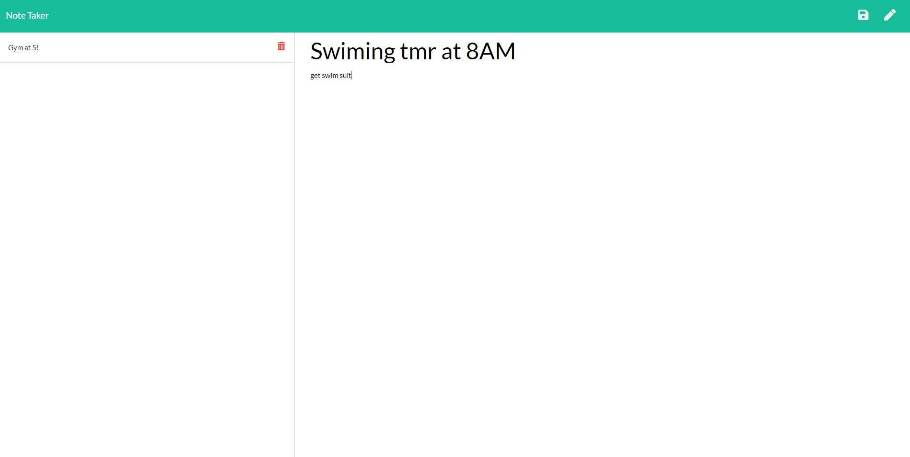

# NoteTaker-App

An app that let user track their notes.

## User Story

AS A small business owner
I WANT to be able to write and save notes
SO THAT I can organize my thoughts and keep track of tasks I need to complete

## Description

The purpose of this application is for user to saved their notes. User can be able to make this app set as homepage and save all their future events or history events. Unlimited notes can be saved and sepereated to left hand side corner, when user click on note then description will show on the right hand side . This app is deployed on [Heroku](https://note-taker-basic.herokuapp.com/) .

## Table of Contents

* [Installation](#installation)
* [Usage](#usage)
* [Deployment](#deployment)

## Installation
 There are several ways to run this app. First, user can run app by using the Heroku link provided below in deployement section. Second, if user want to use this app locally then user needs to install all the dependencies and use " node sever.js " in the command line then access 
 'localhost:3001'. 
 

## Usage 

When run the app, user will lead to a introduction page to get started.

Once clicked, user will lead to another page that they can store all their notes.

## Deployment

Repository link: https://github.com/JamesAHo/NoteTaker-App

Heroku link : https://notet-taker-app.herokuapp.com

